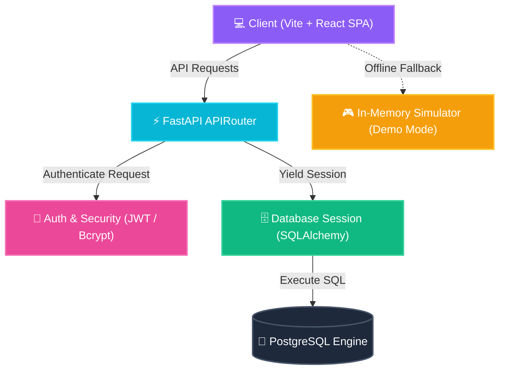

# 🌌 ShopSphere — Next-Gen Fullstack E-Commerce Experience

<div align="center">
  
  [](https://fastapi.tiangolo.com)
  [](https://reactjs.org)
  [](https://www.postgresql.org)
  [](https://vitejs.dev)
  [](https://tailwindcss.com)
  
  <p align="center">
    A futuristic e-commerce platform built with <b>FastAPI</b>, <b>SQLAlchemy</b>, and a stunning <b>Glassmorphism React SPA</b>.
  </p>
</div>

---

## ✨ Features at a Glance

* 🔒 **Role-Based Portal Switching**: Dynamically shifts UI layouts depending on whether the authenticated user is a **Buyer** (Catalog, Cart, Checkout) or a **Seller** (Listing Management, Storefront Listings).
* 🧪 **Resilient Offline Fallback**: The client monitors server status via live testing. If the backend server goes offline, it shifts into a fully simulated **Demo Mode** using mocked state.
* 🛍️ **Glassmorphic Cart Drawer**: Real-time quantity edits, dynamic shipping costs, interactive promo code calculation (`SAVE10`, `SUPER20`), and order logging.
* ⚡ **Ultra-Fast Database Operations**: Structured ORM mappings utilizing **Alembic migrations** and seeded mock profiles.

---

## 🗺️ Visual Architecture Flow



<details>
<summary><b>📐 View Entity-Relationship Database Schema</b></summary>

```mermaid
erDiagram
    USERS {
        int id PK
        string username UNIQUE
        string password
        string role "buyer | seller"
    }
    PRODUCTS {
        int id PK
        string name
{{ ... }}
    }
    ORDERS {
        int id PK
        int user_id FK
        float total
        string status "completed | pending"
    }
    PROMOS {
        int id PK
        string code UNIQUE
        float discount
        boolean active
    }

    USERS ||--o{ PRODUCTS : "registers"
    USERS ||--o{ CARTS : "manages"
    USERS ||--o{ ORDERS : "submits"
    PRODUCTS ||--o{ CARTS : "populates"
```
</details>

---

## 🛠️ REST API Specification

<details>
<summary><b>🔌 Click to expand API Endpoint Map</b></summary>

### Authentication Module
* `POST /auth/register` - Create user profile (checks input rules).
* `POST /auth/login` - Verify login credentials and issue Bearer JWT token.

### Products Module
* `GET /products/` - Get all products currently stored in the database.
* `POST /products/` - Publish a new product listing (requires Seller role).
* `PUT /products/{id}` - Modify price/stock info of an active listing.
* `DELETE /products/{id}` - Remove a product listing from the storefront database.

### Cart & Checkouts
* `POST /cart/` - Insert a product or increment its quantity.
* `GET /cart/` - View the user's cart contents.
* `PUT /cart/{id}` - Adjust quantities of a cart item.
* `POST /orders/` - Validate current cart, subtract inventory stocks, and create an order record.

</details>

---

## ⌨️ Code Highlights

<details>
<summary><b>🗄️ Core Database Session Management (database.py)</b></summary>

```python
# app/database/database.py
from decouple import config
from sqlalchemy import create_engine
from sqlalchemy.orm import sessionmaker, declarative_base

# Load DATABASE_URL from .env
DATABASE_URL = config("DATABASE_URL")

engine = create_engine(DATABASE_URL, echo=True)
SessionLocal = sessionmaker(autocommit=False, autoflush=False, bind=engine)
Base = declarative_base()

def get_db():
    db = SessionLocal()
    try:
        yield db
    finally:
        db.close()
```
</details>

<details>
<summary><b>🔑 Safe Password Encodings & JWT Issuance (security.py)</b></summary>

```python
# app/core/security.py
import bcrypt
from jose import jwt
from datetime import datetime, timedelta
from decouple import config

SECRET_KEY = config("SECRET_KEY", default="supersecret")
ALGORITHM = config("ALGORITHM", default="HS256")

def hash_password(password: str) -> str:
    salt = bcrypt.gensalt()
    return bcrypt.hashpw(password.encode('utf-8'), salt).decode('utf-8')

def verify_password(plain_password: str, hashed_password: str) -> bool:
    return bcrypt.checkpw(plain_password.encode('utf-8'), hashed_password.encode('utf-8'))

def create_access_token(data: dict, expires_delta: timedelta | None = None):
    to_encode = data.copy()
    expire = datetime.utcnow() + (expires_delta or timedelta(minutes=30))
    to_encode.update({"exp": expire})
    return jwt.encode(to_encode, SECRET_KEY, algorithm=ALGORITHM)
```
</details>

<details>
<summary><b>⚛️ Live Fallback Auto-Detection (App.jsx)</b></summary>

```javascript
// src/App.jsx
const testBackendConnection = async () => {
  try {
    const res = await fetch(`${API_BASE}/`);
    if (res.ok) {
      setIsDemoMode(false);
    } else {
      throw new Error("API Offline");
    }
  } catch (err) {
    console.warn("Backend server not responding. Falling back to Demo Mode.");
    setIsDemoMode(true);
    loadMockData(); // Populates active workspace with local listings
  }
};
```
</details>

---

## 🚀 Interactive Quick Start

### 📂 Setup Database
Open your PostgreSQL management tool and query:
```sql
CREATE DATABASE shopsphere;
```

### 💻 Run Backend
In a new terminal window:
```bash
# Enter backend folder
cd ShopSphere/backend

# Add necessary packaging variables
uv add fastapi uvicorn sqlalchemy psycopg2-binary asyncpg pydantic python-decouple alembic bcrypt python-jose[cryptography] passlib

# Execute database schema update
uv run alembic upgrade head

# Seed initial store credentials, items, and promos
uv run python seed.py

# Launch live API server
uv run uvicorn main:app --reload
```

### 🎨 Run Frontend
In a separate terminal window:
```bash
# Enter frontend folder
cd ShopSphere/frontend

# Install package dependencies
npm install

# Start Vite live reload development server
npm run dev
```

🌐 Open [http://localhost:5173](http://localhost:5173) to view the client dashboard. Check the interactive API sandbox at [http://127.0.0.1:8000/docs](http://127.0.0.1:8000/docs).
