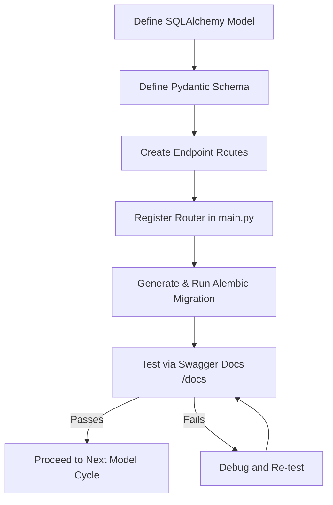

# Backend Approach: Iterative Model-by-Model Development

This document describes the structured, step-by-step developer approach for building the **ShopSphere Backend**. It focuses on an **iterative workflow** where each database entity (model, schema, endpoints, migration) is constructed, integrated, and verified sequentially before proceeding to the next.

---

## The Core Philosophy: "Single-Model Testing"

Rather than writing all database models, schemas, and routes at once, the development follows a **strict cyclical process**:



By verifying each entity fully, database constraints (foreign keys, check constraints) and route responses are guaranteed to work as the codebase grows.

---

## Step 1: Workspace & Base Setup

First, the root environment and workspace entrypoint are prepared:

1. **Initialize Environment**: Set up the project configuration and basic packages using `uv`.
   ```bash
   uv init
   uv add fastapi uvicorn sqlalchemy psycopg2-binary asyncpg pydantic python-decouple alembic bcrypt python-jose[cryptography] passlib
   ```
2. **Create Entrypoint** (`main.py`): Create the central FastAPI application stub:
   ```python
   # main.py
   from fastapi import FastAPI
   app = FastAPI(title="ShopSphere API")
   
   @app.get("/")
   def root():
       return {"message": "Welcome to ShopSphere API"}
   ```
3. **Run Dev Server**:
   ```bash
   uv run uvicorn main:app --reload
   ```
   *Verify that visiting `http://127.0.0.1:8000/` works successfully before moving to the database layer.*

---

## Step 2: Database Connection Layer

Prepare the ORM base and connection lifecycle in [database.py](file:///d:/Ecommerce%20fullstack%20app/ShopSphere/backend/app/database/database.py):
1. Load credentials from environment using `python-decouple`.
2. Instantiate the database engine (`create_engine`) and session factory (`SessionLocal`).
3. Define the base class (`Base = declarative_base()`) from which all models inherit.
4. Establish `get_db()` session lifecycle dependency.

---

## Step 3: Iterative Model Cycles

---

### Cycle 1: User & Authentication

#### 1. Define Model
Create the SQLAlchemy declaration representing User login data and role-based permissions:
* **File**: [user_models.py](file:///d:/Ecommerce%20fullstack%20app/ShopSphere/backend/app/models/User/user_models.py)
* **Fields**: `id` (PK), `username` (Unique), `password` (Hashed), `role` (`buyer` | `seller`).

#### 2. Define Validation Schema
Define validation models checking register/login payloads and API return structures:
* **File**: [user_schema.py](file:///d:/Ecommerce%20fullstack%20app/ShopSphere/backend/app/schemas/User/user_schema.py)
* **Schemas**: `UserCreate` (username, password, role), `UserResponse` (id, username, role).

#### 3. Define Security & Routes
Set up security helpers ([security.py](file:///d:/Ecommerce%20fullstack%20app/ShopSphere/backend/app/core/security.py)) and router endpoints:
* **File**: [auth.py](file:///d:/Ecommerce%20fullstack%20app/ShopSphere/backend/app/routes/v1/auth.py)
* **Endpoints**: 
  * `POST /auth/register` (hashing input passwords).
  * `POST /auth/login` (verifying credentials and returning access tokens).

#### 4. Register Router in Entrypoint
Include the router inside [main.py](file:///d:/Ecommerce%20fullstack%20app/ShopSphere/backend/main.py):
```python
from app.routes.v1 import auth
app.include_router(auth.router, prefix="/auth", tags=["Auth"])
```

#### 5. Generate Migration & Verify
Sync the PostgreSQL schema and test authentication:
```bash
uv run alembic revision --autogenerate -m "create_users_table"
uv run alembic upgrade head
```
* **Verification**: Open Swagger UI (`http://127.0.0.1:8000/docs`), register a dummy user via `/auth/register`, and confirm you receive a JWT via `/auth/login`.

---

### Cycle 2: Products & Catalog

#### 1. Define Model
Add products sold by sellers:
* **File**: [products_model.py](file:///d:/Ecommerce%20fullstack%20app/ShopSphere/backend/app/models/Products/products_model.py)
* **Fields**: `id` (PK), `name`, `price`, `stock`, `seller_id` (FK to `users.id`).

#### 2. Define Schema
Define input schemas and read serialization structures:
* **File**: [products_schema.py](file:///d:/Ecommerce%20fullstack%20app/ShopSphere/backend/app/schemas/Products/products_schema.py)
* **Schemas**: `ProductCreate`, `ProductResponse`.

#### 3. Create Routes
* **File**: [product.py](file:///d:/Ecommerce%20fullstack%20app/ShopSphere/backend/app/routes/v1/product.py)
* **Endpoints**: `POST /products/`, `GET /products/`, `GET /products/{id}`, `PUT /products/{id}`, `DELETE /products/{id}`.

#### 4. Register & Migrate
* Add router to `main.py`: `app.include_router(product.router, prefix="/products")`.
* Run migration:
  ```bash
  uv run alembic revision --autogenerate -m "create_products_table"
  uv run alembic upgrade head
  ```

#### 5. Verify
* **Verification**: Use the token from Cycle 1, execute `POST /products/` to create a product, and verify the record is added to the database using `GET /products/`.

---

### Cycle 3: Shopping Cart Items

#### 1. Define Model
Add cart junctions linking buyers with products:
* **File**: [cart_model.py](file:///d:/Ecommerce%20fullstack%20app/ShopSphere/backend/app/models/Cart/cart_model.py)
* **Fields**: `id` (PK), `user_id` (FK to `users.id`), `product_id` (FK to `products.id`), `quantity` (Int).

#### 2. Define Schema
* **File**: [cart_schema.py](file:///d:/Ecommerce%20fullstack%20app/ShopSphere/backend/app/schemas/Cart/cart_schema.py)
* **Schemas**: `CartItem`, `CartResponse`.

#### 3. Create Routes
* **File**: [cart.py](file:///d:/Ecommerce%20fullstack%20app/ShopSphere/backend/app/routes/v1/cart.py)
* **Endpoints**: `POST /cart/` (add/increment item), `GET /cart/` (list items), `PUT /cart/{id}` (edit quantities), `DELETE /cart/{id}` (remove item).

#### 4. Register & Migrate
* Register in `main.py` and run migrations:
  ```bash
  uv run alembic revision --autogenerate -m "create_cart_table"
  uv run alembic upgrade head
  ```

#### 5. Verify
* **Verification**: Add items to the cart, retrieve them via `GET /cart/`, and assert the buyer matches the logged-in session.

---

### Cycle 4: Orders & Checkouts

#### 1. Define Model
Add purchase order logging:
* **File**: [order_model.py](file:///d:/Ecommerce%20fullstack%20app/ShopSphere/backend/app/models/Orders/order_model.py)
* **Fields**: `id` (PK), `user_id` (FK to `users.id`), `total`, `status` ("completed" | "pending").

#### 2. Define Schema
* **File**: [order_schema.py](file:///d:/Ecommerce%20fullstack%20app/ShopSphere/backend/app/schemas/Orders/order_schema.py)
* **Schemas**: `OrderCreate`, `OrderResponse`.

#### 3. Create Routes
* **File**: [order.py](file:///d:/Ecommerce%20fullstack%20app/ShopSphere/backend/app/routes/v1/order.py)
* **Endpoints**: `POST /orders/` (checkout handler), `GET /orders/` (list user history), `GET /orders/{id}`.

#### 4. Register & Migrate
* Register in `main.py` and run migrations:
  ```bash
  uv run alembic revision --autogenerate -m "create_orders_table"
  uv run alembic upgrade head
  ```

#### 5. Verify
* **Verification**: Execute `POST /orders/` with checkout items and verify the total is correctly calculated and saved.

---

### Cycle 5: Campaigns & Discount Promos

#### 1. Define Model
Create the promotional codes entity:
* **File**: [promo_model.py](file:///d:/Ecommerce%20fullstack%20app/ShopSphere/backend/app/models/Promos/promo_model.py)
* **Fields**: `id` (PK), `code` (Unique string), `discount` (Float percentage), `active` (Boolean).

#### 2. Define Schema
* **File**: [promo_schema.py](file:///d:/Ecommerce%20fullstack%20app/ShopSphere/backend/app/schemas/Promos/promo_schema.py)
* **Schemas**: `PromoCreate`, `PromoResponse`.

#### 3. Create Routes
* **File**: [promo.py](file:///d:/Ecommerce%20fullstack%20app/ShopSphere/backend/app/routes/v1/promo.py)
* **Endpoints**: CRUD endpoints supporting promo code creations, updates, and fetches.

#### 4. Register & Migrate
* Register in `main.py` and run migrations:
  ```bash
  uv run alembic revision --autogenerate -m "create_promos_table"
  uv run alembic upgrade head
  ```

#### 5. Verify
* **Verification**: Add a test promo code like `SAVE10` (10% discount) and verify applying it during checkout reduces the order's final total accordingly.
