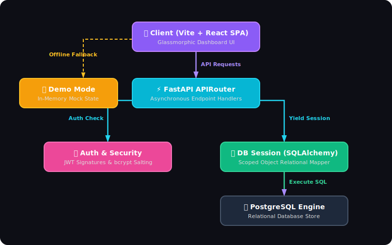
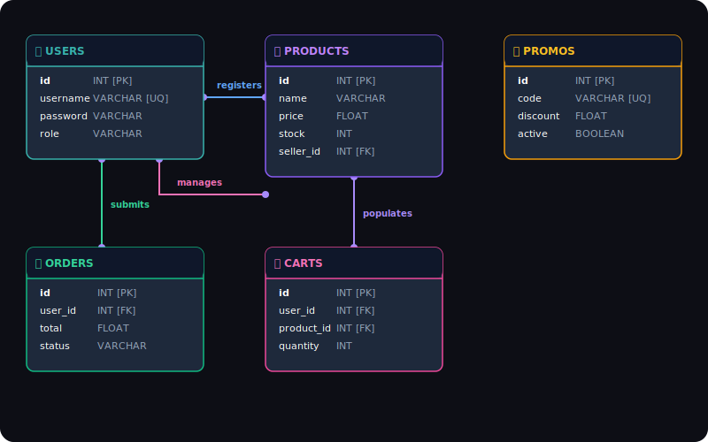

# Developer Approach: ShopSphere E-commerce Fullstack Platform

This document describes the design philosophy, architectural layout, database schemas, codebase structures, and developer workflows implemented in the **ShopSphere** E-commerce application.

---

## 1. Project Overview & Design Philosophy

**ShopSphere** is a high-performance, fullstack e-commerce application constructed with a clean separation of concerns:
- **Backend**: Built with **FastAPI** (Python) for asynchronous performance, utilizing **SQLAlchemy** (ORM) for data operations, **Alembic** for schema migrations, and **PostgreSQL** as the production-grade relational database.
- **Frontend**: Built with **React** (Vite) and styled using custom premium CSS featuring **Glassmorphism**, smooth interactive micro-animations, and full responsiveness. It operates on a smart fallback mechanism, running in **Demo Mode** using in-memory mock data if the backend server is offline.

### Key Goals
1. **Premium Visuals**: Sleek dark-mode aesthetic with harmonized HSL color palettes, custom typography (Outfit / Inter), glass panels, and interactive hover feedback.
2. **Robust Security**: Role-based access control (Buyer vs. Seller), salted password hashing via `bcrypt`, and secure stateless authorization using JSON Web Tokens (JWT).
3. **Resilient Frontend**: Automatically detects API availability and degrades gracefully to an interactive simulator if the backend is down.

---

## 2. Architecture & Data Flow

<p align="center">
  
</p>

### Request-Response Life Cycle
1. **Client Action**: The client triggers a request (e.g., adding an item to the cart or publishing a listing).
2. **Authentication Middleware**: The request includes a Bearer JWT token validated by [security.py](file:///d:/Ecommerce%20fullstack%20app/ShopSphere/backend/app/core/security.py).
3. **FastAPI Route Processing**: Handled by v1 routers which execute database operations within a scoped session.
4. **ORM Translation**: SQLAlchemy models serialize/deserialize Pydantic schemas.
5. **Database Execution**: Actions persist in PostgreSQL.
6. **Frontend State Synchronization**: The client updates local React state and triggers dynamic notifications (toasts).

---

## 3. Database Schema Design

The entity relationship model is composed of five core tables:

<p align="center">
  
</p>

### Table Details
* **Users** ([user_models.py](file:///d:/Ecommerce%20fullstack%20app/ShopSphere/backend/app/models/User/user_models.py)): Stores auth credentials (username, role, hashed passwords).
* **Products** ([products_model.py](file:///d:/Ecommerce%20fullstack%20app/ShopSphere/backend/app/models/Products/products_model.py)): Contains catalogs published by sellers with fields tracking current stock, price, and owning seller ID.
* **Cart Items** ([cart_model.py](file:///d:/Ecommerce%20fullstack%20app/ShopSphere/backend/app/models/Cart/cart_model.py)): Junction table managing buyer shopping carts.
* **Orders** ([order_model.py](file:///d:/Ecommerce%20fullstack%20app/ShopSphere/backend/app/models/Orders/order_model.py)): Logs finalized purchases with checkouts, storing the calculated total and fulfillment status.
* **Promos** ([promo_model.py](file:///d:/Ecommerce%20fullstack%20app/ShopSphere/backend/app/models/Promos/promo_model.py)): Codes (e.g. `SAVE10`, `SUPER20`) storing discount percentages applied at cart checkouts.

---

## 4. Codebase Directory Map

```
└── ShopSphere
    ├── backend
    │   ├── alembic.ini             # Alembic database migration config
    │   ├── pyproject.toml          # uv backend project & dependency setup
    │   ├── main.py                 # FastAPI app entrypoint & middleware registry
    │   ├── seed.py                 # Seeds initial products, promos, and users
    │   ├── migrations/             # Database versions & schema scripts
    │   └── app
    │       ├── core/               # Security utilities, JWT, and authentication guards
    │       ├── database/           # Database creation & SQLAlchemy session setup
    │       ├── models/             # SQLAlchemy ORM declarations (User, Product, Cart, etc.)
    │       ├── routes/v1/          # REST Endpoints: Auth, Product, Cart, Orders, Promos
    │       └── schemas/            # Pydantic schemas validating input/output payloads
    └── frontend
        ├── package.json            # Node.js project manifest & scripts
        ├── vite.config.js          # Vite compilation config
        └── src
            ├── main.jsx            # Application entry render point
            ├── App.jsx             # Combined dashboard logic, view state & API integration
            └── index.css           # Custom Glassmorphism design tokens & styles
```

---

## 5. Phase-by-Phase Developer Implementation Guide

### Phase 1: Environment & Virtual Workspace Initialization
The developer initializes the workspace using modern, high-speed Python tooling:
1. Initialize the backend project with the `uv` toolchain.
2. Install primary packages (`fastapi`, `uvicorn`, `sqlalchemy`, `psycopg2-binary`, `asyncpg`, `pydantic`).
3. Add utility packages (`python-decouple` for `.env` management, `alembic` for migrations, `python-jose` and `bcrypt` for user security).
4. Initialize the database locally inside PostgreSQL: `CREATE DATABASE shopsphere;`.

### Phase 2: Schema Migration & Seeding
Using Alembic ensures the local database mirrors ORM declarations:
1. Run migrations to build tables: `uv run alembic upgrade head`.
2. Seed initial data: `uv run python seed.py`. This populates user credentials (`buyer`/`seller`), initial catalog items (e.g., *Quantum Mech Keyboard*), and active discount codes (`SAVE10`, `SUPER20`).

### Phase 3: REST API Construction
APIs are built as modular sub-routers placed in [routes/v1/](file:///d:/Ecommerce%20fullstack%20app/ShopSphere/backend/app/routes/v1/):
* **Authentication**: [auth.py](file:///d:/Ecommerce%20fullstack%20app/ShopSphere/backend/app/routes/v1/auth.py) implements `/auth/register` and `/auth/login` (generating access tokens).
* **Catalog Management**: [product.py](file:///d:/Ecommerce%20fullstack%20app/ShopSphere/backend/app/routes/v1/product.py) handles listing creations, updates, and listings retrievals.
* **Shopping Cart**: [cart.py](file:///d:/Ecommerce%20fullstack%20app/ShopSphere/backend/app/routes/v1/cart.py) allows buyers to create items, adjust quantities, and clear items.
* **Fulfillment Log**: [order.py](file:///d:/Ecommerce%20fullstack%20app/ShopSphere/backend/app/routes/v1/order.py) creates orders during secure checkouts.
* **Marketing Campaigns**: [promo.py](file:///d:/Ecommerce%20fullstack%20app/ShopSphere/backend/app/routes/v1/promo.py) checks and registers discounts.

### Phase 4: Frontend Development & Aesthetics
The frontend focuses on standard React state, rich design tokens, and resilience:
* **The Design System** ([index.css](file:///d:/Ecommerce%20fullstack%20app/ShopSphere/frontend/src/index.css)): Features deep space background gradients, glass cards using `backdrop-filter: blur(16px)`, customized input elements, and color tokens representing buyer/seller views.
* **Tab-Based Navigation**: Swaps interface contexts (`shop` catalog view, `seller` dashboard list/creation form, `orders` historical records log).
* **Robust Client-Side Integrations**: Implements asynchronous fetch modules. If requests fail, the client triggers **Demo Mode** gracefully, maintaining an enjoyable user experience even when isolated.

---

## 6. How to Extend the Application

To add a new feature (e.g., Product Reviews):
1. **Model Definition**: Add `Review` in `app/models/` mapping review ratings, review body, user ID, and product ID. Import the model in the migration metadata hook.
2. **Database Migration**: Generate schema migration:
   ```bash
   uv run alembic revision --autogenerate -m "add_product_reviews"
   uv run alembic upgrade head
   ```
3. **Pydantic Validation**: Add schemas (`ReviewCreate`, `ReviewResponse`) under `app/schemas/`.
4. **Router Construction**: Write endpoints under a new file `app/routes/v1/review.py` and register it inside [main.py](file:///d:/Ecommerce%20fullstack%20app/ShopSphere/backend/main.py).
5. **UI Enhancement**: Create feedback forms in [App.jsx](file:///d:/Ecommerce%20fullstack%20app/ShopSphere/frontend/src/App.jsx) that allow buyers to rate and submit comments on the detail cards.
